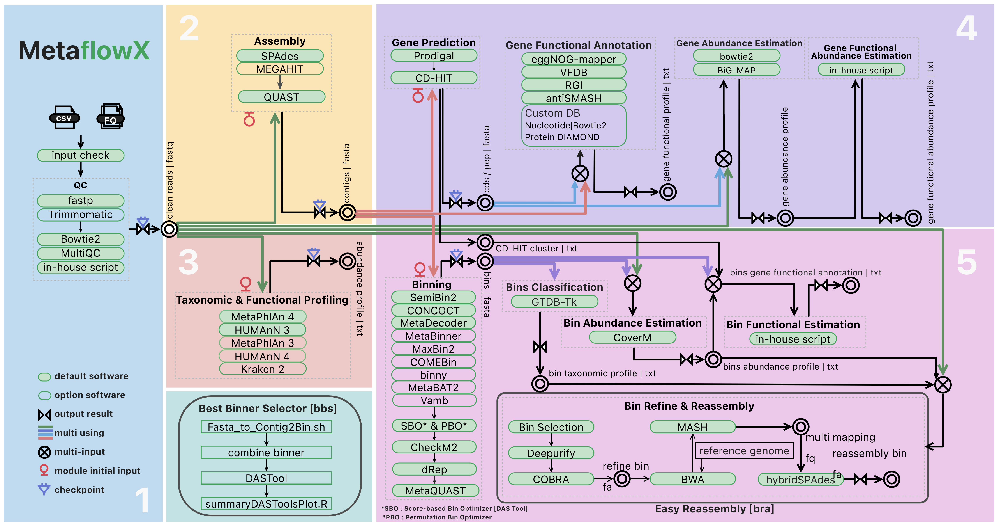

<h1 align="center">
  <picture>
    <source media="(prefers-color-scheme: dark)" srcset="docs/images/nf-core-MetaflowX_logo_dark.png">
    
  </picture>
</h1>


[](https://www.nextflow.io/)
[](https://docs.conda.io/en/latest/)
[](https://www.docker.com/)
[](https://sylabs.io/docs/)
[](https://www.schedmd.com)
[](https://doi.org/10.5281/zenodo.14166585)

# MetaflowX User Manual

**MetaflowX** is a scalable and modular metagenomics analysis pipeline powered by Nextflow. It supports both short-read and contig-based inputs and automates key analyses such as taxonomic profiling, functional annotation, gene catalog construction, and MAG recovery.

<p align="center">
    
</p>


## Contents

- [1. Pipeline Summary](#1-pipeline-summary)
- [2. Getting Started](#2-getting-started)
  - [2.1 Quick Start](#21-quick-start)
  - [2.2 Prerequisites](#22-prerequisites)
  - [2.3 Installation](#23-installation)
  - [2.4 Environment & Database Check](#24-environment--database-check)
- [3. How to Run](#3-how-to-run)
  - [3.1 Basic Usage](#31-basic-usage)
  - [3.2 Advanced Usage](#32-advanced-usage)
- [4. Output](#4-output)
- [5. Support](#5-support)
- [6. Credits](#6-credits)
- [7. Citations](#7-citations)


## 1. Pipeline Summary

The MetaflowX pipeline consists of the following steps:

1. **Quality control** ( [`fastp`](https://github.com/OpenGene/fastp) [`Trimmomatic`](https://github.com/usadellab/Trimmomatic) [`Bowtie2`](https://github.com/BenLangmead/bowtie2))
2. **Contig assembly** ( [`SPAdes`](https://github.com/ablab/spades) [`MEGAHIT`](https://github.com/voutcn/megahit) )
3. **Microbial taxonomy and metabolic function analysis** ( [`MetaPhlAn`](https://github.com/biobakery/MetaPhlAn) [`HUMAnN`](https://github.com/biobakery/humann) [`Kraken2`](https://github.com/DerrickWood/kraken2) )
4. **Gene catalog construction** ( [`Prodigal`](https://github.com/hyattpd/Prodigal) [`CD-HIT`](https://github.com/weizhongli/cdhit) [`eggNOG-mapper`](https://github.com/eggnogdb/eggnog-mapper) [`antiSMASH`](https://github.com/antismash/antismash) [`BiG-MAP`](https://github.com/medema-group/BiG-MAP) )
5. **MAG binning and evaluation** ( [`MetaBAT2`](https://bitbucket.org/berkeleylab/metabat) [`CONCOCT`](https://github.com/BinPro/CONCOCT) [`SemiBin2`](https://github.com/BigDataBiology/SemiBin) [`MaxBin2`](https://sourceforge.net/projects/maxbin/) [`MetaBinner`](https://github.com/ziyewang/MetaBinner) [`COMEBin`](https://github.com/ziyewang/COMEBin) [`binny`](https://github.com/a-h-b/binny) [`MetaDecoder`](https://github.com/liu-congcong/MetaDecoder) [`Vamb`](https://github.com/RasmussenLab/vamb) [`DAS_Tool`](https://github.com/cmks/DAS_Tool) [`MAGScoT`](https://github.com/ikmb/MAGScoT) [`Checkm2`](https://github.com/chklovski/CheckM2) [`dRep`](https://github.com/MrOlm/drep) [`Galah`](https://github.com/wwood/galah?tab=readme-ov-file#galah) [`GTDB-Tk`](https://github.com/Ecogenomics/GTDBTk) [`CoverM`](https://github.com/wwood/CoverM) [`Deepurify`](https://github.com/ericcombiolab/Deepurify) [`COBRA`](https://github.com/linxingchen/cobra) )
6. **Report generation** ( [`Jinja`](https://github.com/pallets/jinja) [`MultiQC`](https://github.com/MultiQC/MultiQC) )

For module-level details, see [Module Description](docs/modules.md).

## 2. Getting Started

### 2.1 Quick Start

If **Nextflow** is already installed, you can quickly validate MetaflowX using demo tests:

**1. Clone the repository:**


```bash
git clone https://github.com/01life/MetaflowX.git
```

**2. Run either of the following tests:**

#### 1️⃣ Test 1: Full pipeline dry run using `stub` mode (no Docker or Conda required)

This test runs the full pipeline structure with small input and stubbed commands (logic is tested, but real computation is skipped). 

It requires **only Nextflow**, no Docker or Conda.

```bash
nextflow run MetaflowX -stub -profile test_stub --outdir stub_remote
```

#### 2️⃣ Test 2: Run a single module (`nf-core/fastp` only, requires **Docker**)

This test runs the built-in `nf-core/fastp` module with a demo input. It requires **Docker**.

```bash
nextflow run MetaflowX -profile test --outdir remote 
```

💡 Both tests finish in a few minutes and produce logs and outputs under the specified `--outdir`.

> [!NOTE]
> If you want to run the Nextflow pipeline in the background, you can add the `-bg` option:
>
> ```bash
> nextflow run -bg MetaflowX -profile test --outdir remote > remote.out
> ```


> [!NOTE]
> ⚠️ These are functional tests only, not for biological analysis.


### 2.2 Prerequisites
We recommend preparing all software environments and databases in advance:

- See [Environment Guide](docs/dependencies.md) for setting up Conda and required tools.
- See [Database Guide](docs/database.md) for downloading and configuring necessary reference data.

 
### 2.3 Installation

1. **Clone the repository:**
  ```bash
   git clone https://github.com/01life/MetaflowX.git
  ```

### 2.4 Environment & Database Check

> [!NOTE]
> If you are new to Nextflow and nf-core, check the [Nextflow installation guide](https://nf-co.re/docs/usage/installation). Ensure your setup passes the `-profile test` before processing real data.

After installation, validate your full environment using built-in paired-end test data under `test/data/`:

- `fullwork_test_sample1_reads1.fq.gz`, `fullwork_test_sample1_reads2.fq.gz`
- `fullwork_test_sample2_reads1.fq.gz`, `fullwork_test_sample2_reads2.fq.gz`

First, prepare an input file `reads.csv` (see [Basic Usage](#31-basic-usage)), then run:

```bash
nextflow run MetaflowX \
   -profile <docker/singularity/conda/.../institute> \
   --input reads.csv \
   --outdir full_test
```

This run will:

- Check tool availability
- Verify database paths
- Execute major pipeline steps

> [!IMPORTANT]
> ⚠️ Before running, ensure that the following configuration files are properly set:
>
> - `nextflow.config`: general defaults, database paths
> - `conf/modules.config`: tool environments and options
> - `conf/base.config`: compute resources (CPU, memory)
>
> ✅ Match the `-profile` flag to your local compute environment.
>
> 💡 You can use `-profile slurm`, `-profile docker`, `-profile local`, etc.

⏱️ This test may take several minutes depending on system specs.


## 3. How to run

### 3.1 Basic usage


1. Prepare a samplesheet `samplesheet.csv` with your input data that looks as follows:


```csv
id,raw_reads1,raw_reads2
S1,/path/to/Sample1_R1.fastq.gz,/path/to/Sample1_R2.fastq.gz
S2,/path/to/Sample2_R1.fastq.gz,/path/to/Sample2_R2.fastq.gz
```

2. Now, you can run the pipeline using:

```bash
nextflow run MetaflowX \
   -profile <docker/singularity/conda/.../institute> \
   --input samplesheet.csv \
   --outdir <OUTDIR>
```

> [!WARNING]
> Please provide pipeline parameters via the CLI or Nextflow `-params-file` option. Custom config files including those provided by the `-c` Nextflow option can be used to provide any configuration _**except for parameters**_;
> see [docs](https://nf-co.re/usage/configuration#custom-configuration-files).

For more details and further functionality, please refer to the [usage documentation](docs/usage.md). You can use the following command to see all the parameters of the pipeline.

   ```bash
   nextflow run MetaflowX --help
   ```


> [!NOTE]
> MetaflowX relies on plenty of tools and their databases. For detailed installation and configuration instructions, please refer to the [dependencies guide](docs/dependencies.md), [database guide](docs/database.md) and [version documentation](docs/version.md).


### 3.2 Advanced Usage

MetaflowX supports:

- Single-end and paired-end reads
- Selective module execution using `--mode` and `--skip` parameters
- Custom database paths and tool options

📖 For a full overview of available parameters and advanced configuration, see the [Usage Guide](docs/usage.md).

📘 For practical examples of common execution modes and corresponding commands, refer to the [Execution Guide]().


## 4. Output

The results generated by MetaflowX include the following sections:

✤ **Quality control**
- 01.CleanData/

✤ **Contig assembly**
- 02.Contig

✤ **Microbial taxonomy and metabolic function analysis**
- 101.MetaPhlAn  
- 102.HUMAnN

✤ **Gene catalog construction**
- 03.Geneset  
- 04.GenesetProfile

✤ **Automated binning analysis**
- 05.BinSet  
- 06.BinsetProfile 

✤ **Report generation**
- 07.MultiQC
- MetaflowX_Report_*.html

✤ **Pipeline information**
- pipeline_info 

See [Output Documentation](docs/output.md) for details.


## 5. Support

- Visit the [MetaflowX tutorial](docs/usage.md) for examples and explanations.
- Check the [Changelog](CHANGELOG.md) for version history.
- Report issues via the [GitHub Issues page](https://github.com/01life/MetaflowX/issues).


## 6. Credits
❤️ MetaflowX was developed with support from 01Life. ️

MetaflowX is developed by:

👩‍💻 Yang Ying  
👩‍💻 Liang Lifeng  

With contributions and feedback from:

👨 Xie Hailiang
👨‍💻 Long Shibin  


## 7. Citations

If you use MetaflowX in your research, please cite:

> **MetaflowX: A Scalable and Resource-Efficient Workflow for Multi-Strategy Metagenomic Analysis**

For all third-party tools used, refer to [`CITATIONS.md`](CITATIONS.md).

