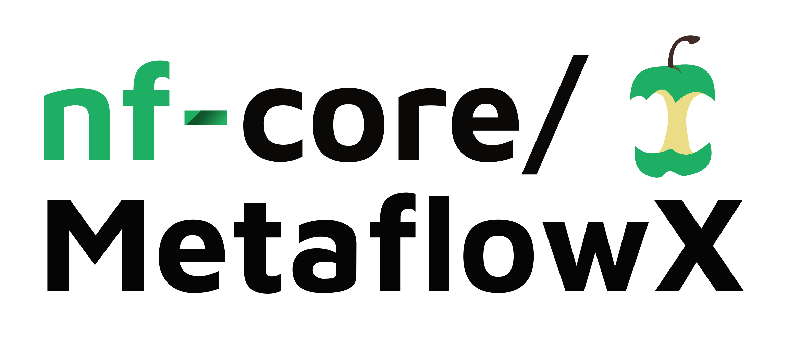
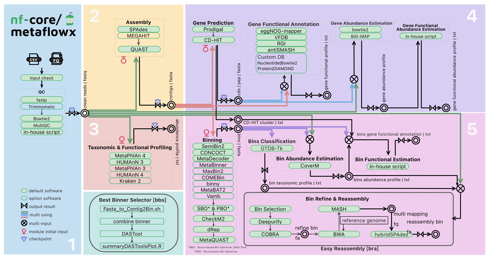

<h1 align="center">
  <picture>
    <source media="(prefers-color-scheme: dark)" srcset="docs/images/nf-core-MetaflowX_logo_dark.png">
    
  </picture>
</h1>


[](https://www.nextflow.io/)
[](https://docs.conda.io/en/latest/)
[](https://www.docker.com/)
[](https://sylabs.io/docs/)
[](https://tower.nf/launch?pipeline=https://github.com/nf-core-metassembly)


# MetaflowX User Manual

<!-- TODO nf-core: Write a 1-2 sentence summary of what data the pipeline is for and what it does -->

**MetaflowX** MetaflowX is a Nextflow-based metagenomics analysis workflow that processes short-read sequences and/or assembled contigs to automatically generate taxonomic compositions, community functional profiles, non-redundant gene catalogs with functional annotations, and high-quality MAGs.

<p align="center">
    
</p>

## Contents

- [Pipeline Summary](##pipeline_summary)
- [Getting Startedy](##getting_started)
  - [Prerequisites](###prerequisites)
  - [Installation](###installation)
- [Basic Usage](##basic_usage)


## Pipeline Summary

<!-- TODO nf-core: Fill in short bullet-pointed list of the default steps in the pipeline -->

1. Quality control ( [`fastp`](https://github.com/OpenGene/fastp) [`Trimmomatic`](https://github.com/usadellab/Trimmomatic) [`Bowtie2`](https://github.com/BenLangmead/bowtie2))
2. Contig assembly ( [`SPAdes`](https://github.com/ablab/spades) [`MEGAHIT`](https://github.com/voutcn/megahit) )
3. Microbial taxonomy and metabolic function analysis ( [`MetaPhlAn`](https://github.com/biobakery/MetaPhlAn) [`HUMAnN`](https://github.com/biobakery/humann) [`Kraken2`](https://github.com/DerrickWood/kraken2) )
4. Gene catalog construction ( [`Prodigal`](https://github.com/hyattpd/Prodigal) [`CD-HIT`](https://github.com/weizhongli/cdhit) [`eggNOG-mapper`](https://github.com/eggnogdb/eggnog-mapper) [`antiSMASH`](https://github.com/antismash/antismash) [`BiG-MAP`](https://github.com/medema-group/BiG-MAP) )
5. Automated binning analysis ( [`MetaBAT2`](https://bitbucket.org/berkeleylab/metabat) [`CONCOCT`](https://github.com/BinPro/CONCOCT) [`SemiBin2`](https://github.com/BigDataBiology/SemiBin) [`MaxBin2`](https://sourceforge.net/projects/maxbin/) [`MetaBinner`](https://github.com/ziyewang/MetaBinner) [`COMEBin`](https://github.com/ziyewang/COMEBin) [`binny`](https://github.com/a-h-b/binny) [`DAS_Tool`](https://github.com/cmks/DAS_Tool) [`Checkm2`](https://github.com/chklovski/CheckM2) [`dRep`](https://github.com/MrOlm/drep) [`GTDB-Tk`](https://github.com/Ecogenomics/GTDBTk) [`CoverM`](https://github.com/wwood/CoverM) [`Deepurify`](https://github.com/ericcombiolab/Deepurify) [`COBRA`](https://github.com/linxingchen/cobra) )
6. Report generation ( [`Jinja`](https://github.com/pallets/jinja) [`MultiQC`](https://github.com/MultiQC/MultiQC) )


For the details implementation of each module in the pipeline, please refer to the [module description](docs/modules.md).


## Getting Started

### Prerequisites
To ensure smooth analysis with MetaflowX, we strongly recommend pre-building both the software components and the reference databases before starting your analysis.

- [Environment Installation and Configuration](docs/dependencies.md)
  - An overview of how to make a new conda environment to install and manage all dependencies for the pipeline.
- [Database Installation and Configuration](database.md)
  - An overview of the steps to download and set up the database parameters for the pipeline.

  
### Installation

1. **Clone the repository:**
  ```bash
   git clone https://github.com/01life/MetaflowX.git
  ```

## Basic Usage

> [!NOTE]
> If you are new to Nextflow and nf-core, please refer to [this page](https://nf-co.re/docs/usage/installation) on how to set-up Nextflow. Make sure to [test your setup](https://nf-co.re/docs/usage/introduction#how-to-run-a-pipeline) with `-profile test` before running the workflow on actual data.

1. Prepare a samplesheet with your input data that looks as follows:

`samplesheet.csv`:

```csv
id,raw_reads1,raw_reads2
S1,/path/to/Sample1_R1.fastq.gz,/path/to/Sample1_R2.fastq.gz
S2,/path/to/Sample2_R1.fastq.gz,/path/to/Sample2_R2.fastq.gz
```

2. Now, you can run the pipeline using:

```bash
nextflow run MetaflowX \
   -profile <docker/singularity/conda/.../institute> \
   --input samplesheet.csv \
   --outdir <OUTDIR>
```

> [!WARNING]
> Please provide pipeline parameters via the CLI or Nextflow `-params-file` option. Custom config files including those provided by the `-c` Nextflow option can be used to provide any configuration _**except for parameters**_;
> see [docs](https://nf-co.re/usage/configuration#custom-configuration-files).

For more details and further functionality, please refer to the [usage documentation](docs/usage.md). You can use the following command to see all the parameters of the pipeline.

   ```bash
   nextflow run MetaflowX --help
   ```


> [!NOTE]
> MetaflowX relies on plenty of tools and their databases. For detailed installation and configuration instructions, please refer to the [dependencies guide](docs/dependencies.md), [database guide](docs/database.md) and [version documentation](docs/version.md).


## Tutorials and resources


MetaflowX tutorial
MetaflowX output
MetaflowX change log


- [Usage](usage.md)
  - An overview of how the pipeline works, how to run it and a description of all of the different command-line flags.
- [Output](output.md)
  - An overview of the results file produced by the pipeline and how to interpret them.


## Credits

MetaflowX was originally written by 👩‍💻yangying and 👩‍💻Liang lifeng.

We thank the following people for their extensive assistance in the development of this pipeline:

👨‍💻Long Shibin
👨Xie hailiang


<!-- TODO nf-core: If applicable, make list of people who have also contributed -->


## Citations

If you use nf-core/mag for your analysis, please cite the preprint as follows:

> **MetaflowX: A Scalable and Resource-Efficient Workflow for Multi-Strategy Metagenomic Analysis**
>


An extensive list of references for the tools used by the pipeline can be found in the [`CITATIONS.md`](CITATIONS.md) file.
