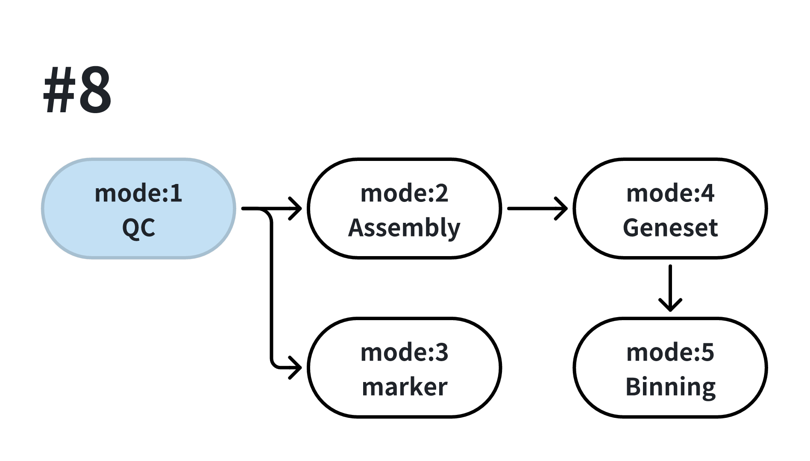

# 📘 MetaflowX Execution Guide: Common Execution Modes and Command Examples

🚀 [MetaflowX User Manual](../../README.md)

MetaflowX is a flexible and scalable metagenomic workflow that supports the entire analysis process, from raw sequencing data to high-quality MAG reconstruction and annotation. This document provides 30+ typical use cases with command examples, organized by input types and analysis goals, to help users get started quickly.
All commands are executed via Nextflow and support both local and cluster environments. Each example includes a brief description to help beginners understand the intent of the execution.

 <p align="center">
    
</p>


## Contents

<!-- toc -->
- [📂 Input File Format Guide](#-input-file-format-guide)
- [🧭 Execution Scenarios and Command Templates](#-execution-scenarios-and-command-templates)
  - [🔹 mode0: One-click Execution of Multiple Modules](#-mode0-one-click-execution-of-multiple-modules)
  - [🔹 mode1: Quality Control](#-mode1-quality-control)
  - [🔹 mode2: Assembly](#-mode2-assembly)
  - [🔹 mode3: Reference-based Taxonomic Profiling](#-mode3-reference-based-taxonomic-profiling)
  - [🔹 mode4: Gene Set Construction and Annotation](#-mode4-gene-set-construction-and-annotation)
  - [🔹 mode5: MAG Construction and Annotation](#-mode5-mag-construction-and-annotation)
<!-- tocstop -->

## 📂 Input File Format Guide
The main input is specified via the --input parameter, in CSV format. Column names vary based on the analysis mode and supported fields are listed below:
| Column           | Description                                                                                      |
|------------------|--------------------------------------------------------------------------------------------------|
| id               | Custom sample ID. Use the same ID for multiple libraries from the same sample.                   |
| raw_reads1/2     | Path to raw Illumina reads. Must end in `.fastq.gz` or `.fq.gz`.                                 |
| clean_reads1/2   | Path to quality-filtered reads.                                                                  |
| contig           | Path to assembled contigs file in `.fa` format.                                                  |
| pep/cds          | Predicted protein (`pep`) or nucleotide (`cds`) sequences.                                       |
| rawbin_folder    | Folder containing per-sample original bin sets.                                                  |
| quality_report   | CheckM2 quality report for the corresponding bins.                                               |
| HQ_unique_bins   | Folder containing high-quality, non-redundant MAGs.                                              |


✅ For details and examples, please refer to example input or the  [`example_input/`](example_input) directory.


## 🧭 Execution Scenarios and Command Templates

The following use cases are grouped by analysis mode (mode0 to mode5) and categorized by input type (raw reads, clean reads, contigs).

---

### 🔹 mode0: One-click Execution of Multiple Modules

 <p align="center">
    
</p>

📌 Case 1: Run full pipeline with raw reads (mode 1+2+3+4+5)
```bash
nextflow -bg run MetaflowX --input raw.csv --outdir <OUTDIR>
```
📌 Case 2: Skip reference-based taxonomy profiling
```bash
nextflow -bg run MetaflowX --input raw.csv --outdir <OUTDIR> --skip_marker
```
📌 Case 3: Skip MAG binning
```bash
nextflow -bg run MetaflowX --input raw.csv --outdir <OUTDIR> --skip_binning
```
📌 Case 4: Run full pipeline with clean reads (mode 2+3+4+5)
```bash
nextflow -bg run MetaflowX --input clean.csv --outdir <OUTDIR> --skip_qc
```
📌 Case 5: Skip reference-based taxonomy profiling with clean reads
```bash
nextflow -bg run MetaflowX --input clean.csv --outdir <OUTDIR> --skip_qc --skip_marker
```
📌 Case 6: Skip binning with clean reads
```bash
nextflow -bg run MetaflowX --input clean.csv --outdir <OUTDIR> --skip_qc --skip_binning
```
📌 Case 7: Skip both reference-based profiling and binning
```bash
nextflow -bg run MetaflowX --input clean.csv --outdir <OUTDIR> --skip_qc --skip_marker --skip_binning
```
---

### 🔹 mode1: Quality Control
 <p align="center">
    
</p>

📌 Case 8: Run quality filtering on raw reads only
```bash
nextflow -bg run MetaflowX --input raw.csv --outdir <OUTDIR> --mode 1
```
Use this mode if you only need to filter and clean raw reads.

---
### 🔹 mode2: Assembly
 <p align="center">
    
</p>

📌 Case 9: Assemble raw reads
```bash
nextflow -bg run MetaflowX --input raw.csv --outdir <OUTDIR> --mode 2
```
📌 Case 10: Assemble clean reads
```bash
nextflow -bg run MetaflowX --input clean.csv --outdir <OUTDIR> --mode 2
```

---
### 🔹 mode3: Reference-based Taxonomic Profiling
 <p align="center">
    
</p>

📌 Case 11: Taxonomic profiling using raw reads
```bash
nextflow -bg run MetaflowX --input raw.csv --outdir <OUTDIR> --mode 3
```

📌 Case 12: Taxonomic profiling using clean reads
```bash
nextflow -bg run MetaflowX --input clean.csv --outdir <OUTDIR> --mode 3
```


---
### 🔹 mode4: Gene Set Construction and Annotation

 <p align="center">
    
</p>
📌 Case 13: Construct and annotate gene catalog from contigs
```bash
nextflow -bg run MetaflowX --input clean_contig.csv --outdir <OUTDIR> --mode 4
```
📌 Case 14: Only build gene catalog, skip all downstream analysis
```bash
nextflow -bg run MetaflowX --input clean_contig.csv --outdir <OUTDIR> --mode 4 \
  --gene_abundance_calculation false --gene_function false
```
📌 Case 15: Build gene catalog + gene abundance
```bash
nextflow -bg run MetaflowX --input clean_contig.csv --outdir <OUTDIR> --mode 4 \
  --gene_function false

📌 Case 16: Build gene catalog + functional annotation only
```bash
nextflow -bg run MetaflowX --input clean_contig.csv --outdir <OUTDIR> --mode 4 \
  --gene_abundance_calculation false
```
📌 Case 17: Only run gene prediction for each sample
```bash
nextflow -bg run MetaflowX --input clean_contig.csv --outdir <OUTDIR> --mode 4 \
  --geneset_construction false --gene_abundance_calculation false --gene_function false
```
📌 Case 18: Provide existing gene predictions, run full downstream analysis
```bash
nextflow -bg run MetaflowX --input clean_contig.csv --outdir <OUTDIR> --mode 4 \
  --prodigal_output prodigal.csv
```
📌 Case 19: Provide gene predictions, skip downstream analysis
```bash
nextflow -bg run MetaflowX --input clean_contig.csv --outdir <OUTDIR> --mode 4 \
  --prodigal_output prodigal.csv --gene_abundance_calculation false --gene_function false
```
📌 Case 20: Provide gene predictions, run gene abundance only
```bash
nextflow -bg run MetaflowX --input clean_contig.csv --outdir <OUTDIR> --mode 4 \
  --prodigal_output prodigal.csv --gene_function false
```
📌 Case 21: Provide gene predictions, run functional annotation only
```bash
nextflow -bg run MetaflowX --input clean_contig.csv --outdir <OUTDIR> --mode 4 \
  --prodigal_output prodigal.csv --gene_abundance_calculation false
```

---
### 🔹 mode5: MAG Construction and Annotation
 <p align="center">
    
</p>

📌 Case 22: Run complete MAG binning and downstream analysis
```bash
nextflow -bg run MetaflowX --input clean_contig.csv --outdir <OUTDIR> --mode 5
```
📌 Case 23: Only perform binning, skip all downstream steps
```bash
nextflow -bg run MetaflowX --input clean_contig.csv --outdir <OUTDIR> --mode 5 \
  --bin_taxonomy false --bin_function false --bin_abundance_calculation false
```
📌 Case 24: Binning + taxonomy annotation only
```bash
nextflow -bg run MetaflowX --input clean_contig.csv --outdir <OUTDIR> --mode 5 \
  --bin_function false --bin_abundance_calculation false
```
📌 Case 25: Binning + taxonomy + abundance
```bash
nextflow -bg run MetaflowX --input clean_contig.csv --outdir <OUTDIR> --mode 5 \
  --bin_function false
```
📌 Case 26: Binning + taxonomy + function annotation
```bash
nextflow -bg run MetaflowX --input clean_contig.csv --outdir <OUTDIR> --mode 5 \
  --bin_abundance_calculation false
```
📌 Case 27: Provide predicted genes, run full binning + downstream analysis
```bash
nextflow -bg run MetaflowX --input clean_contig.csv --outdir <OUTDIR> --mode 5 \
  --prodigal_output prodigal.csv
```
📌 Case 28: Provide predicted genes + sample bins, run full binning + downstream analysis
```bash
nextflow -bg run MetaflowX --input clean_contig.csv --outdir <OUTDIR> --mode 5 \
  --prodigal_output prodigal.csv --rawbin_info rawbin.csv
```
📌 Case 29: Provide predicted genes + sample bins, skip downstream steps
```bash
nextflow -bg run MetaflowX --input clean_contig.csv --outdir <OUTDIR> --mode 5 \
  --prodigal_output prodigal.csv --rawbin_info rawbin.csv \
  --bin_taxonomy false --bin_function false --bin_abundance_calculation false
```
📌 Case 30: Use existing MAGs for taxonomy only
```bash
nextflow -bg run MetaflowX --input clean_contig.csv --outdir <OUTDIR> --mode 5 \
  --HQ_unique_bins <OUTDIR>/05.BinSet/051.UniqueBin/HQUniqueBins/all \
  --bin_function false --bin_abundance_calculation false
```
📌 Case 31: Use existing MAGs for abundance only
```bash
nextflow -bg run MetaflowX --input clean_contig.csv --outdir <OUTDIR> --mode 5 \
  --HQ_unique_bins <OUTDIR>/05.BinSet/051.UniqueBin/HQUniqueBins/all \
  --bin_taxonomy false --bin_function false
```
📌 Case 32: Use existing MAGs for functional annotation only
```bash
nextflow -bg run MetaflowX --input clean_contig.csv --outdir <OUTDIR> --mode 5 \
  --HQ_unique_bins <OUTDIR>/05.BinSet/051.UniqueBin/HQUniqueBins/all \
  --bin_taxonomy false --bin_abundance_calculation false
```