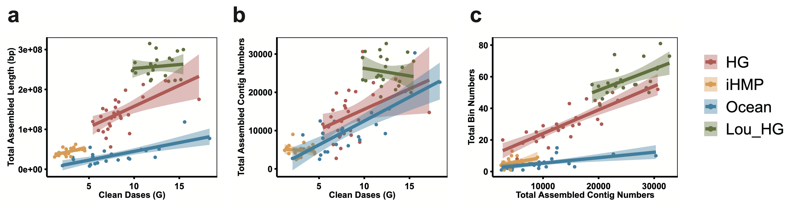

# Resource Requirement and Runtimes
MetaflowX is a multi-task parallel execution pipeline whose runtime and resource requirements are strongly correlated with the volume of sequencing data. MetaflowX also integrates diverse software and extensive databases, posing challenges for migration across computational platforms. We evaluated MetaflowX’s computational resource requirements, runtime, and portability using datasets of varying sequencing depths across different environments and computational platforms. Resource requirements for metagenomic analysis are influenced by several factors, including sample number, sequencing data volume, analysis complexity, tool performance, and database volume. We evaluated MetaflowX’s resource requirements and computation time using four real-world metagenomic projects with varying environments and sequencing data volumes. The test datasets included three human gut microbiome projects (iHMP - 20 samples, 56.38 GB; Human Early Life Cohort - 23 samples, 289.74 GB; Internal Chinese Adult Cohort - 28 samples, 236.67 GB, unpublished) and one marine project (24 samples, 188.75 GB). We observed linear relationships between the number of reads and both the total number and length of contigs obtained from assembly. A similar linear trend was observed between the total number of contigs and the number of bins. Consequently, we consider the data volume range of 1-15 GB to be a meaningful reference for these analyses (Figure 1).

Evaluations were conducted on Alibaba Cloud spot instances, utilizing 30 computers, each equipped with an Intel Xeon Platinum CPU @ 2.5GHz, 32 cores, and 64GB of RAM. MetaflowX generates 13 times the number of tasks as samples by default. We provide an optimal performance configuration, which users can adjust for cost-efficiency ([`Reference`](https://github.com/01life/MetaflowX/blob/main/conf/base.config)). Our evaluation showed that CPU time and real runtime for fastp, MetaPhlAn, and bowtie2 tasks generally increases proportionally with data size. SemiBin2, metaBAT2, CONCOCT, and DAS Tool demonstrate lower resource consumption, correlating with contig number and length. HUMAnN and metaspades are resource-intensive tasks, often running concurrently and representing peak computational demand (Figure 2, Figure 3, Figure 4). On average, analyzing 8 GB of sequencing data using 32 cores requires 8-10 hours, with metaspades potentially taking longer for complex samples. Notably, HUMAnN and metaspades often run concurrently in MetaflowX, representing one of the peak computational demands.

The construction of non-redundant gene catalog and bins sets becomes increasingly time-consuming with larger data volumes. On instance with 32 cores and 64 GB memory, CD-HIT and dRep tasks may exceed 24 hours, extending the overall MetaflowX workflow. To address this, MetaflowX implements a divide-and-conquer strategy for CD-HIT and dRep tasks, splitting them into smaller subtasks before merging results. This approach maintains comparable outcomes while reducing runtime. By default, when redundant genes surpass 1 million, MetaflowX partitions them into 0.5 million-gene subsets for CD-HIT analysis. Similarly, it splits over 800 redundant bins into 200-bin sets for dRep execution. Similarly, gtdb-tk and eggnog-mapper tasks align bin genome and gene sequences with GTDB and eggNOG databases, respectively. Executing these tasks on all non-redundant sequences simultaneously would be time-consuming. Therefore, MetaflowX executes gtdb-tk tasks on every 500 bins and eggnog-mapper tasks on every 10,000 genes, effectively increasing parallelism and reducing reliance on high-performance computing resources. 

MetaflowX was developed and tested on Alibaba Cloud’s eHPC using SLURM for task management. We successfully conducted migration tests on AWS Cloud Platform using “AWS Batch” executor, Tencent Cloud’s eHPC using “TES” executor, and a local computer with 32 cores and 128 GB memory. Users can run MetaflowX on different computational platforms by modifying database and software paths, demonstrating its portability and flexibility.

    

Figure 1. Relationship between sequence data volume, contig set, and bin set volume across diverse metagenomic datasets. a Total assembled length plotted against clean bases (Gb). b Total number of assembled contigs plotted against clean bases (Gb). c Total number of bins plotted against total number of assembled contigs. Each step's performance is evaluated across four different datasets: three human gut microbiome projects (Internal Chinese Adult Cohort (HG, n=28, unpublished), Integrated Human Microbiome Project (iHMP, n=20), and Human Early Life Cohort (Lou_HG, n=23)), and one marine project (Ocean, n=24) (see Supplementary File 1). Data points are displayed with fitted trend lines and 95% confidence intervals (shaded areas).
 

    

Figure 2. Runtime of metagenomic analysis steps on diverse real metagenome datasets. Real runtime (in hours) is plotted against clean bases (in gigabases) for 12 metagenomic analysis steps: FASTP, PRODIGAL, MEGAHIT, METASPADES, HUMANN, METAPHLAN, BOWTIE2BIN, BOWTIE2GENE, CONCOCT, METABAT2, SEMIBIN2, and CHECKM2. Data points are displayed with fitted trend lines and 95% confidence intervals (shaded areas). The x-axis represents the size of clean data in gigabases (G), and the y-axis shows the real runtime in hours (H). Empirical fitting functions for data volume and runtime at each step are provided in Supplementary Table 13.
  

    

Figure 3. CPU hours for metagenomic analysis steps across diverse datasets. CPU hours plotted against clean bases (Gb) for 12 metagenomic analysis steps: FASTP, PRODIGAL, MEGAHIT, METASPADES, HUMANN, METAPHLAN, BOWTIE2BIN, BOWTIE2GENE, CONCOCT, METABAT2, SEMIBIN2, and CHECKM2. Data points are shown with fitted trend lines and 95% confidence intervals (shaded areas). The x-axis represents clean data size in gigabases (Gb), and the y-axis shows CPU hours (h). Empirical fitting functions for data volume and runtime at each step are provided in Supplementary Table 13.
  

    

Figure 4. Relationship between total assembled length and CPU hours across diverse metagenomic datasets. CPU hours plotted against total assembled length for 6 metagenomic analysis steps: PRODIGAL, BOWTIE2GENE, CONCOCT, METABAT2, SEMIBIN2, and DASTOOL. Data points are shown with fitted trend lines and 95% confidence intervals (shaded areas).
