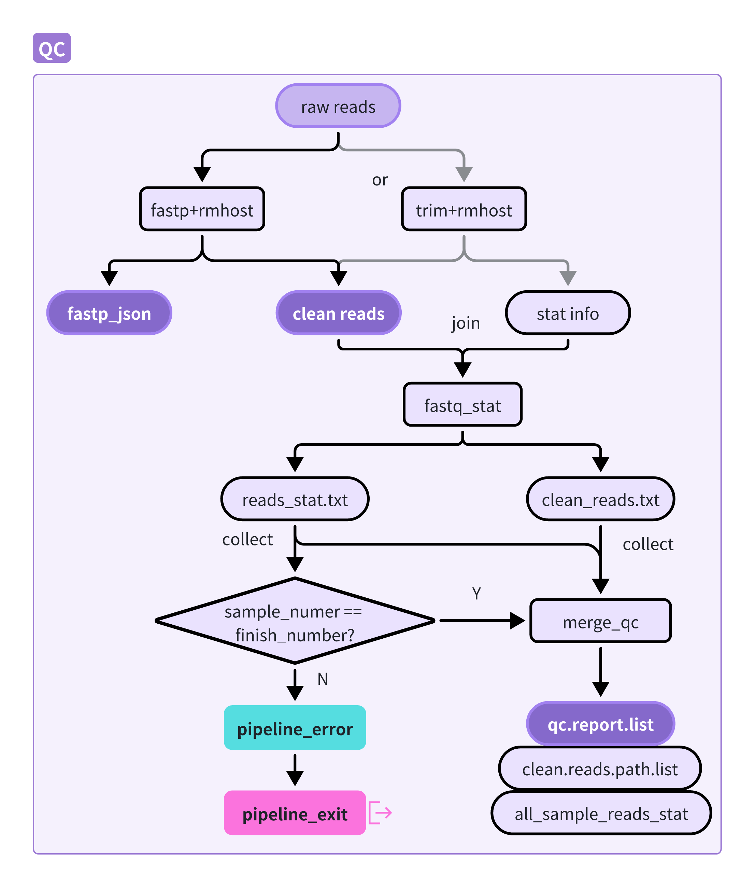
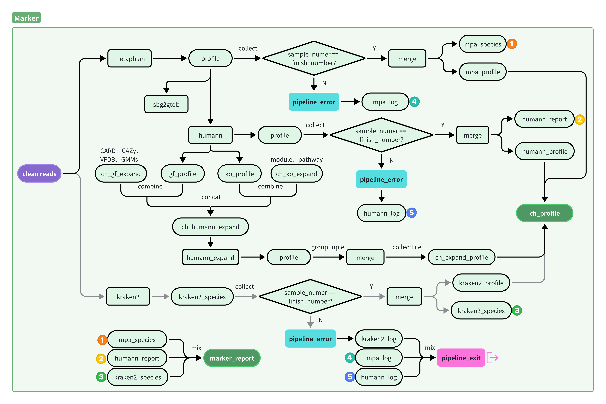
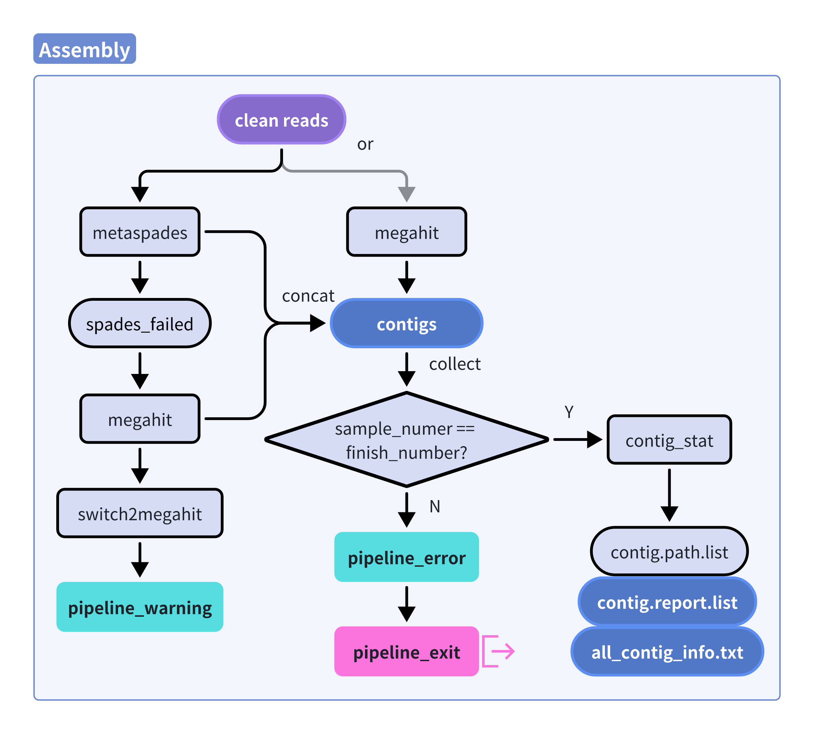
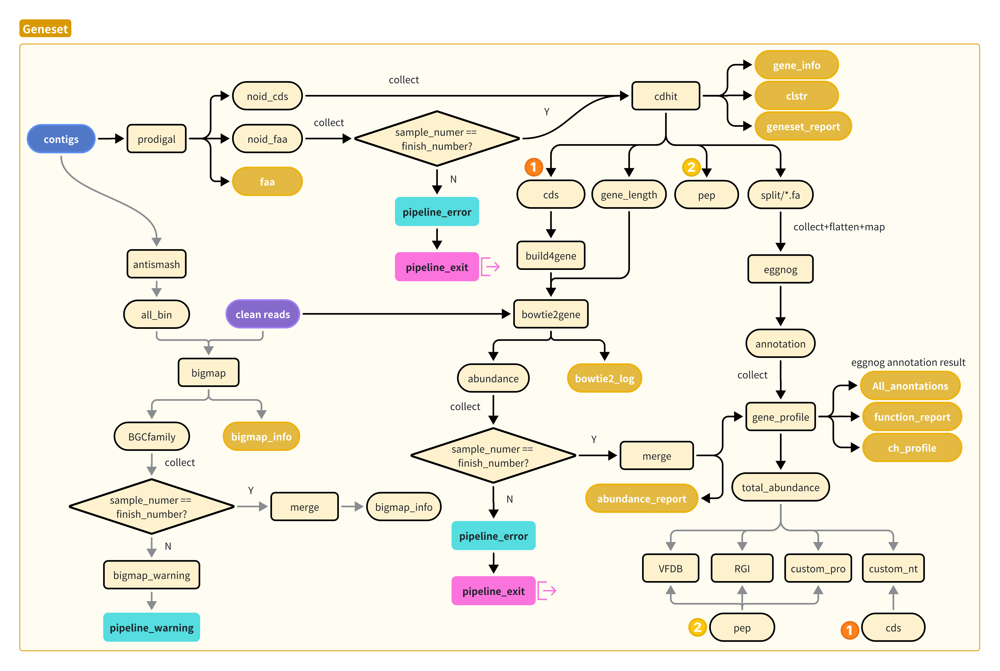
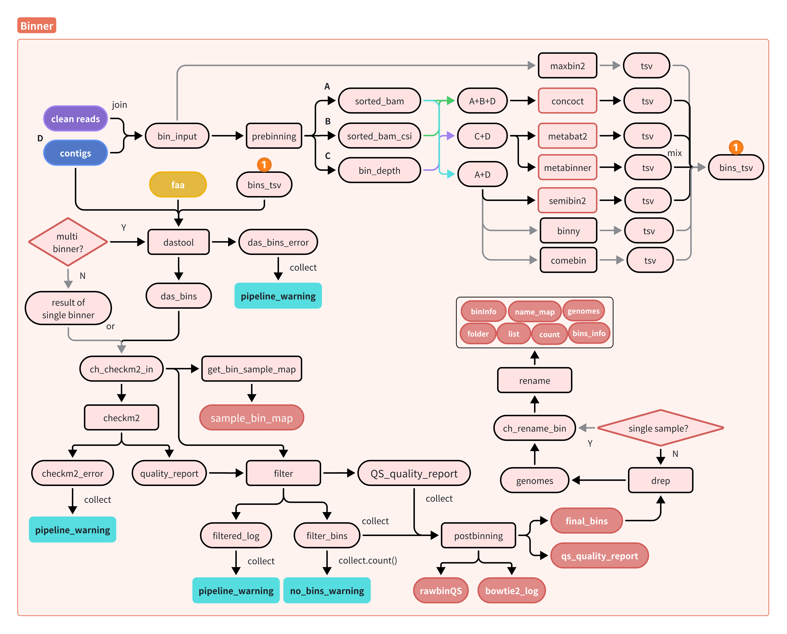
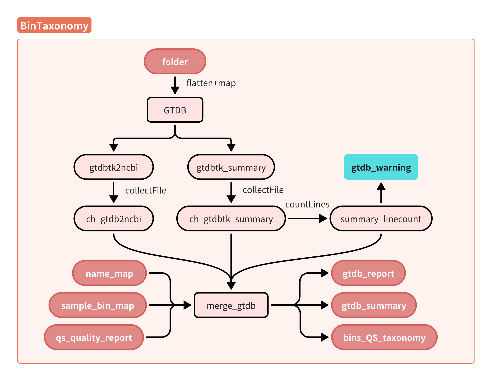
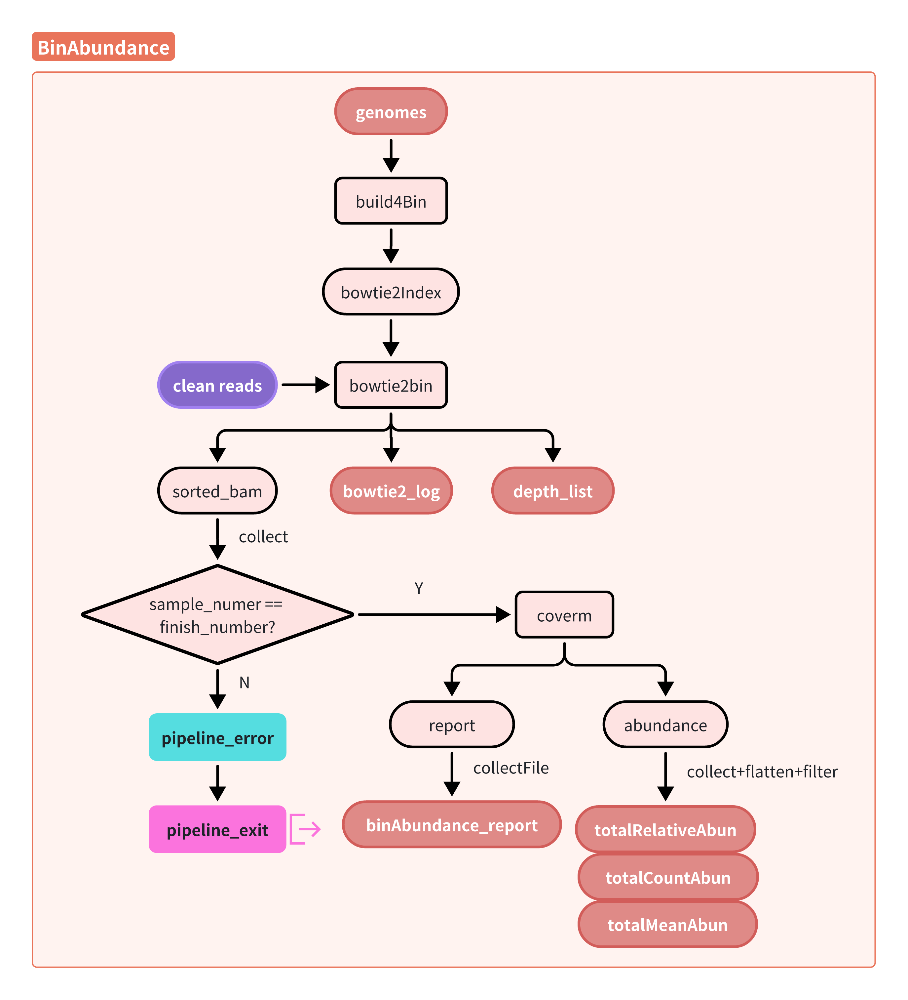
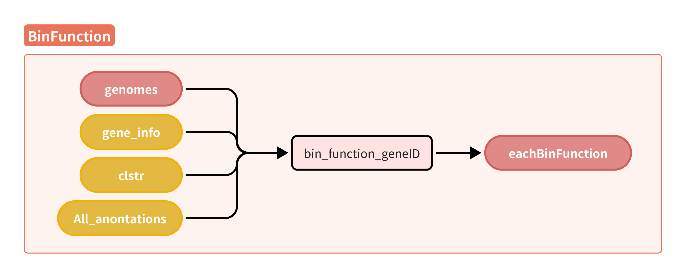
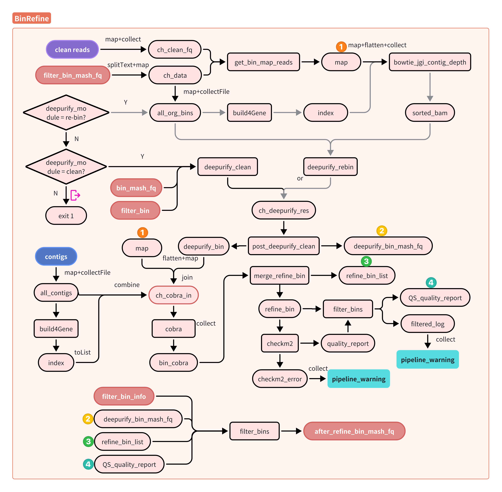
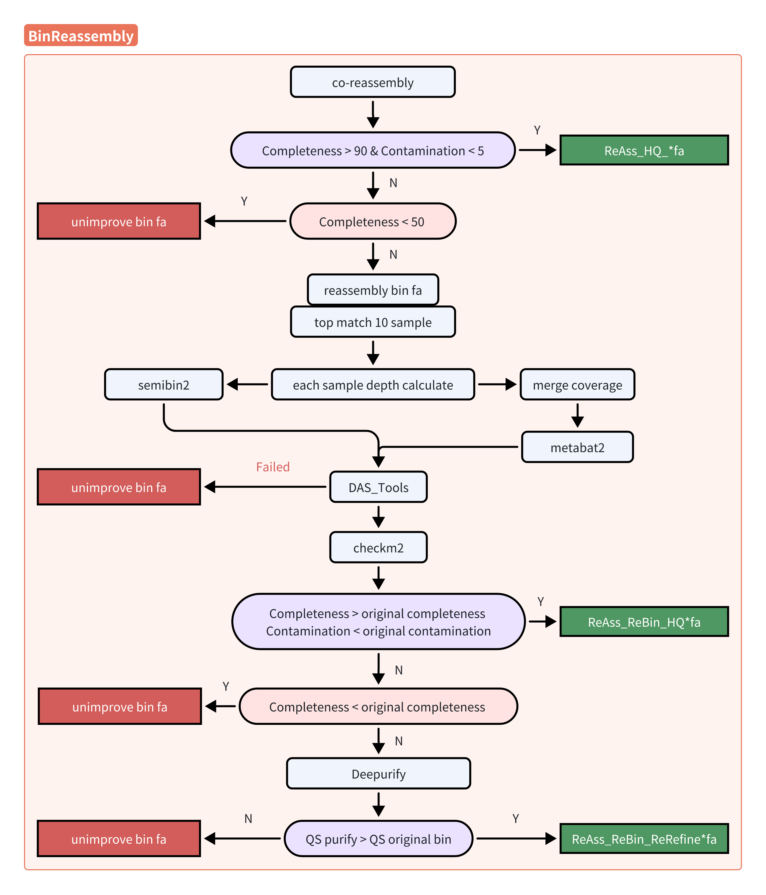

# Detailed Descriptions of Each Module
MetaflowX segments the complex metagenomic analysis workflow into multiple modules, each operable independently or in integration. The following sections provide a detailed description of the software used within each module, their parameters, and how the resulting files are interconnected. All modules offer fine-grained control over the microbiome analysis workflow by allowing users to customize parameters through command-line options or configuration files ([nextflow.config](../nextflow.config ) or [params.config](../params.config)). Several pre-defined configurations for common scenarios are available at [usage.md](./usage.md).

- [MetaflowX-INPUT_CHECK](#metaflowx-input_check)
- [MetaflowX-QC](#metaflowx-qc-quality-control-for-microbiome-analysis)  
- [MetaflowX-Marker](#metaflowx-marker-marker-gene-based-profiling-for-taxonomic-composition-and-functional-potential)
- [MetaflowX-Assembly](#metaflowx-assembly-flexible-short-read-assembly)  
- [MetaflowX-Geneset](#metaflowx-geneset-community-metabolic-potential-analysis)
- [MetaflowX-Binning](#metaflowx-binning-mag-generation-and-abundance-of-estimation)
- [MetaflowX-RefineReassembly](#metaflowx-refinereassembly-enhanced-bin-genome-reconstruction)

## MetaflowX-INPUT_CHECK
The INPUT_CHECK sub-workflow is a crucial component of MetaflowX. It validates essential inputs and configurations to minimize pipeline failures, ensuring robust execution. MetaflowX offers flexibility, allowing users to run selected modules, enable checkpointing, or execute single function `--function`, which call 'minitools' in paper. The pipeline typically initiates with raw Illumina paired-end (PE) reads but can accommodate clean paired reads, single-end (SE) sequences, or assembled contigs in specific scenarios (e.g., `--skip_QC` or `--mode 5`). INPUT_CHECK dynamically adapts to input types, skipping unnecessary steps to enhance efficiency. For instance, when clean reads are provided, the QC step is automatically bypassed. The module also ensures consistency of sample names, verifies size uniformity of FASTQ files, and confirms their validity as GZIP-compressed files. This robust input validation enhances pipeline reliability and reduces computational waste, streamlining the subsequent metagenomic analysis workflow.

## MetaflowX-QC: Quality Control for Microbiome Analysis
The MetaflowX-QC module preprocesses raw short sequencing reads, preparing high-quality data for downstream assembly and alignment. It employs either Fastp (version 0.23.4, default) or Trimmomatic (version 0.39) for read quality control. These tools remove low-quality reads, adapter sequences, duplicate sequences, and reads below a specified length threshold. Parameters are optimized for 150 bp PE reads. The parameters for Fastp include: `--adapter_fasta TruSeq3-PE.fa -g -q 5 -u 50 -n 15 -l 75 --overlap_diff_limit 1 --overlap_diff_percent_limit 10`. For Trimmomatic, the parameters are: `ILLUMINACLIP:TruSeq3-PE.fa:2:30:10 LEADING:5 TRAILING:5 SLIDINGWINDOW:4:15 MINLEN:75 -phred33`. Host read removal is performed using Bowtie2 (version 2.5.0) with an in-house Python script [rmhost_with_bowtie2.py](../bin/rmhost_with_bowtie2.py). Quality assessment is conducted using an in-house Perl script that evaluates metrics such as read length distribution, quality scores, and GC content. MultiQC (version 1.14) generates comprehensive HTML reports for Fastp results, facilitating quality control interpretation. The module outputs clean, high-quality reads suitable for subsequent metagenomic analyses, along with detailed QC reports for each sample.

    

## MetaflowX-Marker: Marker Gene-Based Profiling for Taxonomic Composition and Functional Potential
The MetaflowX-Marker module performs comprehensive taxonomic profiling and functional potential assessment using marker genes. It employs either MetaPhlAn (version 4.0.6, default) or Kraken2 (version 2.1.3) for rapid taxonomic classification, generating detailed 7-level taxonomic profiles. Microbial functional profiling is conducted using HUMAnN3 (version 3.6), which determines the abundance of metabolic pathways and molecular functions. Gene families are annotated using UniRef90 (version v201901b) definitions, while pathways are annotated based on the MetaCyc database. HUMAnN3's 'regroup' function facilitates transitions to alternative functional databases, including KEGG, GO, and COG, enhancing analytical flexibility. Post-processing steps include consolidation of individual sample abundance tables and quality control checks to ensure proper execution of MetaPhlAn and HUMAnN3. Anomalous samples are flagged in detailed logs for prompt user intervention. The module outputs integrated taxonomic and functional profiles, along with quality assessment reports, enabling robust comparative analyses across samples and cohorts. This module operates independently of the assembled genome analysis modules, allowing for rapid, reference-based insights.

    

## MetaflowX-Assembly: Flexible Short Read Assembly
The MetaflowX-Assembly module provides flexible short read assembly using either metaSPAdes (version 3.15.5, default) or MEGAHIT (version 1.2.9). It processes any number of clean reads FASTP files, supporting single-sample assembly rather than co-assembly. MEGAHIT offers resource efficiency for large datasets, while metaSPAdes generally produces superior assemblies despite higher computational demands. In cases where available computational resources are insufficient for metaSPAdes or data complexity prevents successful assembly, MetaflowX automatically switches to MEGAHIT after multiple retries with increasing computational resources. This adaptive approach ensures the generation of contigs for all samples, thus maintaining data continuity, although it may result in assemblies produced by different software tools within a single project. Post-assembly, contigs shorter than 2000 bp (default) are removed. Qualified contigs undergo analysis, with basic information collected for HTML report visualization. Users can customize assembly parameters via command-line options or configuration files, allowing for optimization based on specific research needs and computational constraints.

    

## MetaflowX-Geneset: Community Metabolic Potential Analysis
The MetaflowX-Geneset module was employed to analyze community-wide metabolic potential through a series of bioinformatic processes: gene prediction, non-redundant geneset construction, functional annotation, and abundance estimation.

Gene Prediction: Protein-coding sequences were predicted from assembled contigs using Prodigal (version 2.6.3) with the metagenomic option (`-p meta`). Predicted genes shorter than 150 bp were excluded from further analysis.

Non-redundant Geneset Construction: CD-HIT (version 4.8.1) was used to dereplicate the predicted genes, employing the following parameters: 95% sequence identity (`-c 0.95`), 90% alignment coverage of the shorter sequence (`-aS 0.9`), word size of 10 (`-n 10`), unlimited memory (`-M 0`), and full sequence description in output (`-d 0`). For datasets exceeding 8 million genes, the geneset was automatically partitioned into subsets of 0.3 million genes to facilitate processing.

Functional Annotation: Functional annotation was primarily conducted using eggNOG-mapper (version 2.1.3) with the EggNOG5 (version 5.0.2) database. Annotations were converted to common functional classification systems including KEGG, GO, and Pfam. To optimize computational efficiency, the geneset was processed in batches of 10,000 genes. MetaflowX supports several additional annotation databases, including (1) Virulence factor identification using DIAMOND blastp (version 2.0.15) against the VFDB and custom protein databases; (2) Antibiotic resistance gene (ARG) detection using the Resistance Gene Identifier (RGI, version 6.0.2) with the CARD database; (3) Biosynthetic gene cluster (BGC) identification using antiSMASH (version 6.1.1); (4) Custom nucleic acid database searches using a Bowtie2-based pipeline (version 2.5.0) for coding sequence (CDS) queries.

Gene Abundance Estimation: Gene abundances were estimated by mapping sample reads to the non-redundant geneset using Bowtie2 (version 2.5.0). The resulting alignment files were processed using a custom Python script ([get_geneset_abundance.py](../bin/get_geneset_abundance.py)) to calculate gene abundances. Functional attribute quantification was performed using the Python script ([get_abundance_4eggNOG-mapper.py](../bin/get_abundance_4eggNOG-mapper.py)), while BGC abundances were assessed using BiG-MAP (version 1.0.0).

Gene characteristics, such as length distribution and GC content across the community, along with gene abundance, were summarized in an HTML report. This comprehensive approach offers a flexible framework for investigating community metabolic potential, making it adaptable to various metagenomic studies.

    

## MetaflowX-Binning: MAG Generation and Abundance of Estimation
The MetaflowX-Binning module facilitates microbial genome recovery through five core functions: contig binning, bin dereplication, abundance estimation, taxonomic classification, and functional annotation.

Contig Binning: Seven binning algorithms are available: metaBAT2 (version 2.12.1), MaxBin2 (version 2.2.7), CONCOCT (version 1.1.0), MetaBinner (version 1.4.4), binny (version 2.2.15), COMEBin (version 1.0.), and SemiBin2 (version 2.1.0). Based on CAMI II benchmarking, the default strategy employs metaBAT2, CONCOCT, and SemiBin2 to generate MAGs per sample. DAS Tool (version 1.1.6) integrates MAGs produced by multiple binners.

Bin Quality Assessment: CheckM2 (version 1.0.1) assesses bin completeness and contamination. Medium-quality bins are defined as those with >50% completeness, <10% contamination, and a quality score (QS = completeness - 5 × contamination) >40, adhering to MIMAG criteria.

Bin Dereplication: dRep (version 3.4.3) selects representative bins using parameters `-sa 0.95 -nc 0.3 --ignoreGenomeQuality`. For efficient processing of large datasets, redundant bin sets exceeding 800 bins are split into 200-bin chunks.

    

Taxonomic Classification: GTDB-Tk (version 2.3.2) performs taxonomic annotation using the 'classify_wf' function with parameters `--extension fa --pplacer_cpus 1 --scratch_dir ./`. For datasets exceeding 500 MAGs, GTDB-Tk implements batch processing of 500 MAGs per task.

    

Abundance Estimation: CoverM (version 0.7.0) calculates MAG coverage using three methods: relative abundance, trimmed mean, and count. These values are subsequently utilized in the RefineReassembly module.

    

Functional Annotation: A Python script ([get_eachBin_FunctionGeneID.py](../bin/get_eachBin_FunctionGeneID.py)) extracts gene information and functional annotations from associated contigs, utilizing predictions from the Geneset module.

    

Lineage Abundance Regrouping: Based on the GTDB reference tree and bin abundance profiles, MetaflowX regroups seven levels of lineage abundance, distinguishing between valid names and placeholder names requiring replacement.

This comprehensive binning module provides a robust framework for MAG generation, taxonomic classification, and functional characterization, with built-in strategies for handling large-scale metagenome datasets.

## MetaflowX-RefineReassembly: Enhanced Bin Genome Reconstruction
The MetaflowX-RefineReassembly module employs multifaceted approaches to improve bin quality through reassembly of bin genomes using reads from multiple closely related samples.

Bin Selection and Read Extraction: Target bins were selected based on CoverM-derived count profiles (>100,000 reads) and depth profiles (>1). BWA (version 0.7.17-r1188) and samtools (version 1.17) were used to extract reads matching the target bin genome and its closest GTDB reference genome (as determined by GTDB-tk taxonomy annotation). In cases where the GTDB reference genome (version release214) was unavailable, only the target bin genome was used for reads extraction.

    

Sample Selection for Co-assembly: The sample with the highest abundance of extracted reads was identified as the target sample for each bin. Mash (version 2.3) sketches were utilized to select up to nine additional closely related samples based on mash distance. Extracted reads from all selected samples were collected as co-match reads.

Assembly and Initial Quality Assessment: SPAdes was employed to assemble co-match reads into contigs. Contigs longer than 2000 bp, after filtering coverage outliers, underwent initial quality assessment using CheckM2. Bins with >90% completion and <5% contamination were classified as high-quality (HQ) and retained.

Rebinning and Refinement: Bins not meeting HQ criteria underwent rebinning using SemiBin2 (single-coverage strategy) and MetaBAT2 (multi-coverage strategy). DAS Tool consolidated the best bin from all potential bin sets, followed by CheckM2 assessment. Bins still not meeting HQ criteria were further refined using DeepPurify. Improvement was determined by comparing the post-refinement quality score to the initial score.

Quality Control: At each quality assessment step, bins with <50% completion were excluded from further reassembly and marked as not improvable by this strategy.

Single-sample Assembly Option: The RefineReassembly module also supports single-sample assemblies, utilizing only the native sample (the sample from which the target bin was first recovered) for reassembly.

This module provides a comprehensive approach to bin genome reconstruction improvement, integrating co-assembly and single-sample assembly strategies with iterative quality assessment and refinement steps.

    

